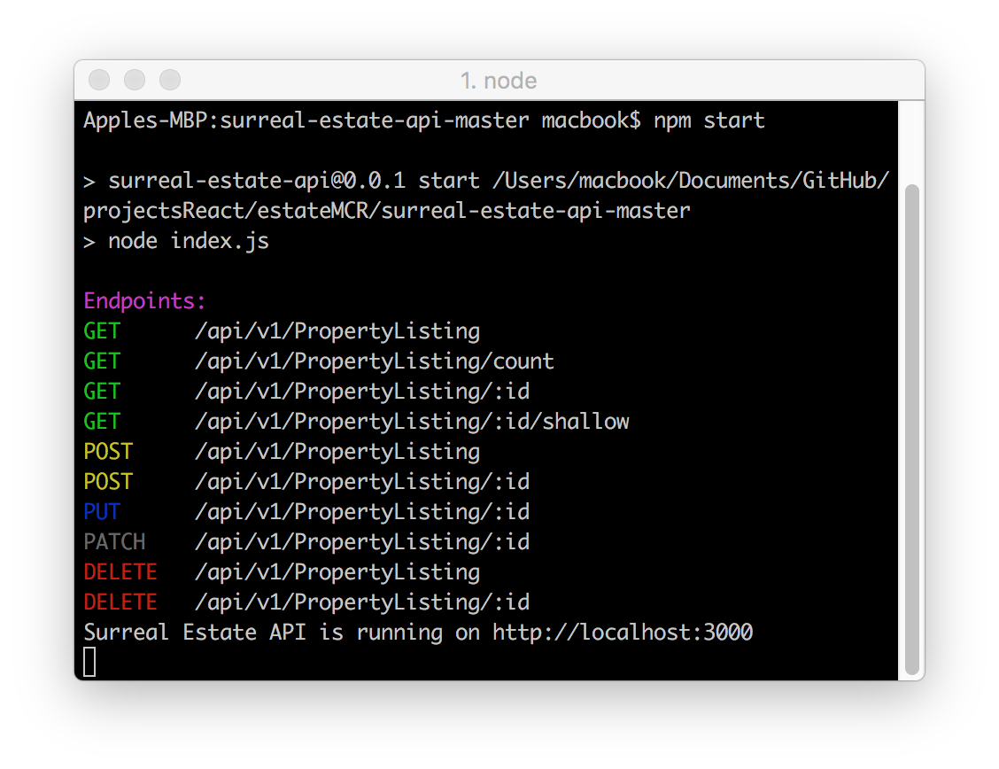
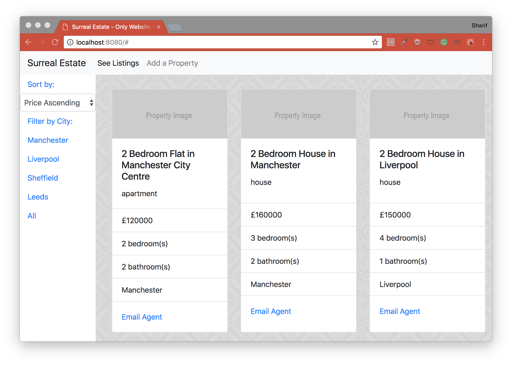

## Surreal Estate - Bootstrap React Project
Bootstrap React project for Week 15 at Manchester Codes

<b>Please Note:</b> This repository contain two repositories; an APi (managing data), and Frontend (viewing data). You need to generate some data beforehand.

Making a make HTTP requests in React; going to be covering forms, form validation, posting data to API and routing in React, a popular front-end framework for building user interfaces.

### Surreal Estate API

### Surreal Estate Frontend

#### Concepts
- HTML Forms
- Form Validation
- Interacting with an API
- React Routing

#### Built with
* [npm](https://www.npmjs.com/) - Node Package Manager
* [React](https://www.npmjs.com/package/react) - An npm package to get you immediate access to React
* [React DOM](https://www.npmjs.com/package/react-dom) - This package serves as the entry point of the DOM-related rendering paths
* [express-restify-mongoose](https://github.com/florianholzapfel/express-restify-mongoose) - Easily create a flexible REST interface for mongoose models
* [axios](https://github.com/axios/axios) - Promise based HTTP client for the browser and node.js
